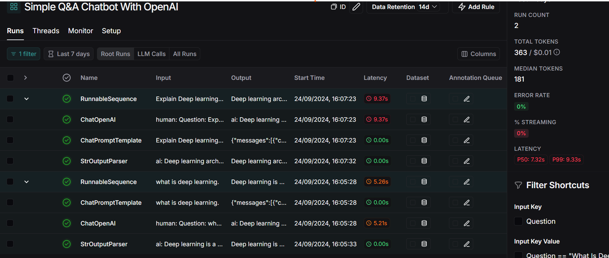

 
# Enhanced Q&A Chatbot With OpenAI and Langsmith


This project is a simple yet powerful Q&A chatbot built using Streamlit and LangChain with OpenAI's GPT models. It allows users to input a question and get a response from the GPT-4 model. Users can configure the model, response temperature, and token limits via the app's sidebar.


 

## Features
 
1)OpenAI GPT Integration: Leverages OpenAI's GPT models (gpt-4, gpt-4-turbo) for answering user queries.

2)Customizable Settings: Configure the response generation by adjusting the model type, temperature, and token count.

3)Streamlit Interface: Provides a clean and simple user interface for interacting with the chatbot.

4)LangChain Integration: Uses LangChain to manage the prompt templates and API calls.

5)LangSmith Tracking: Tracks API requests and responses using LangSmith

### Prerequisites

Python 3.8+.

Streamlit

OpenAI API Key

LangChain and LangChain-OpenAI
### Usage
Enter OpenAI API Key: In the sidebar, provide your OpenAI API Key.

Select Model: Choose between gpt-4 and gpt-4-turbo.

Adjust Settings: Set the temperature (creativity level) and maximum tokens (response length).

Ask Questions: Input your question, and the chatbot will generate a response.

### Configuration Options
API Key: Your OpenAI API key is required to interact with the model.

Model Selection: Choose between different GPT-4 models for responses.

Temperature: Adjust the randomness in responses (0.0 = deterministic, 1.0 = more creative).

Max Tokens: Limit the length of the response (50–300 tokens).
 

 
### Project Structure
 

```bash
├── app.py               # Main application code
├── .env                 # Environment variables (not included in Git)
├── requirements.txt      # Python dependencies
└── README.md             # Project README file

```
     

### Contributing
If you'd like to contribute to this project, please feel free to submit a pull request or open an issue.
 
## Screenshots

### Simple app 

.png)

### Langsmith monitoring




